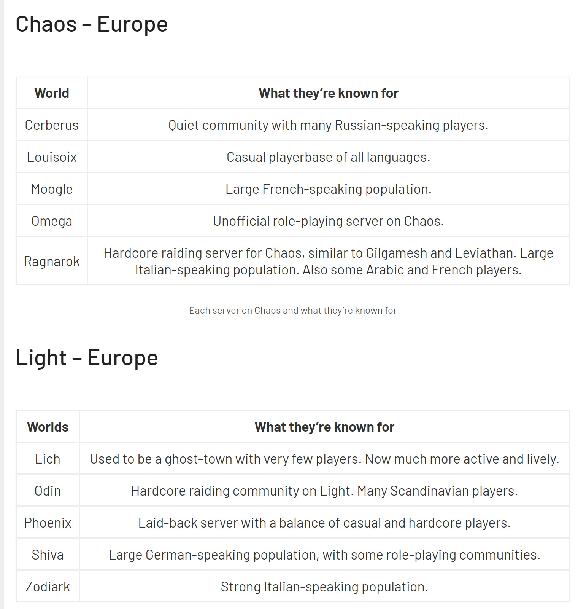

FFXIV General 
=============================
- [Как начать играть](#Как-начать-играть)
- - [Бесплатный триал](#Бесплатный-триал)
- - [Полная версия](#Полная-версия)
- - [Оплата игрового времени](#Оплата-игрового-времени)
- - [Выбор сервера](#Выбор-сервера)
- [Ресурсы](#Ресурсы)
- - [Вики и гайды](#Вики-и-гайды)
- - [Прокачка профессий](#Прокачка-профессий)
- - [Гламур](#Гламур)
- [Моддинг](#Моддинг)
- - [Русский язык](#Русский-язык)

# Как начать играть
## Бесплатный триал 
Бесплатный триал доступен в [стиме](https://store.steampowered.com/app/312060/FINAL_FANTASY_XIV_Online_Free_Trial/) либо [на специальном сайте](https://freetrial.finalfantasyxiv.com/gb/).
Особенности триала:
* Максимальный уровень - 60 (из 80 возможных)
* Доступен контент только ванильной игры и аддона heavensward
* Максимальное количество гил (внутриигровой валюты на триале) - 300.000
* Невозможно стоять в очереди (по вечерам очереди частое явление)
## Полная версия
Для игры в полную версию необходимо купить базовую игру (включает в себя предыдущие дополнения) + актуальное дополнение за фулл прайс. 
Рекомендую купить [стим-версию](https://store.steampowered.com/bundle/9957/FINAL_FANTASY_XIV_Online_Complete_Edition/) для оплаты подписки по региональным для РФ ценам
## Оплата игрового времени
Оплата производится через [Mog Station](https://mogstation.com/)
- Стоимость подписки методом автопродления через стим: 235 рублей/месяц
- Стоимость единоразовой подписки через стим: 900 рублей
- Стоимость подписки для non-steam версии: от 11 до 13 евро/месяц

Для оплаты методом автопродления через стим:
* Зайти в свой аккаунт на [Mog Station](https://mogstation.com/)
* Раздел **Your Account**
* В таблице подписки нажать **Steam Payment**
* Subscrition - Standart,  Subscription Period - какой желаете, Payment Method - Steam Account (Auto Renewal) 

Если внезапно дропните игру отказаться от подписки можно в настройках стима.

## Выбор сервера
Положняк по европейским датацентрам на пикче. Большинство русскоговорящих игроков и анонов из треда играет на Церберусе, ДЦ Chaos. Для людей с ДВ подойдет японский дата-центр. Сервер Tonberry, на нем самое большое количество англоговорящих игроков в рамках японского ДЦ.

# Ресурсы
## Вики и гайды, и всякие инструменты
- [оФФициальная база данных](https://na.finalfantasyxiv.com/lodestone/playguide/db/)
- [https://ffxiv.consolegameswiki.com/wiki](https://ffxiv.consolegameswiki.com/wiki)
- [Гайды по боевым профессиям](https://saltedxiv.com)
- [Гайд по релик оружию](http://ffxivguild.com/ffxiv-relic-zodiac-weapon-complete-guide)
- [Лутлист, калькулятор гира](http://ffxiv.ariyala.com)

## Прокачка профессий
- [FFXIV Crafting](http://ffxivcrafting.com)
- [5.05 Crafting & Gathering Guide](https://docs.google.com/document/d/1L1aDMxZOjhdmzsilToDvsrwqfcUOs6NKxhsCBa1IwVQ/preview)
- [Гайд по быстрой прокачке крафта](https://docs.google.com/spreadsheets/d/1zL5XrqwMej9RKTcGslVg3by5OnpKWxf_wStcZT97N-Q/edit#gid=0)

## Гламур
- [Где достать гламур/прическу/маунта](https://ffxivcollect.com/)
- [Eorzea Collection](https://ffxiv.eorzeacollection.com/) Сайт с тонной всякого гламура

# Моддинг

## Русский язык

Русского языка в игре нет и не будет. Если ты совсем не понимаешь англюсик, можешь воспользоваться машинным переводом с помощью программы [TataruHelper](https://github.com/NightlyRevenger/TataruHelper), которая работает поверх основного окна игры

Из встроенных возможностей в игре можно только двигать/увеличивать интерфейс, для всего остального используется моды.

### [FFXIVQuickLauncher](https://github.com/goatcorp/FFXIVQuickLauncher) 
Лаунчер для запуска игры в обход стима, позволяет устанавливать Dalamud плагины из репозитория не выходя из игры и не снимая свитер 
### [Advanced Combat Tracker](https://advancedcombattracker.com/download.php)
Так же является платформой для плагинов, самые популярные:
- Демейдж метр - [гайд по установке и настройке](https://gist.github.com/TomRichter/e044a3dff5c50024cf514ffb20a201a9)
- [Cactbot](https://github.com/quisquous/cactbot) - Оверлейд для рейда